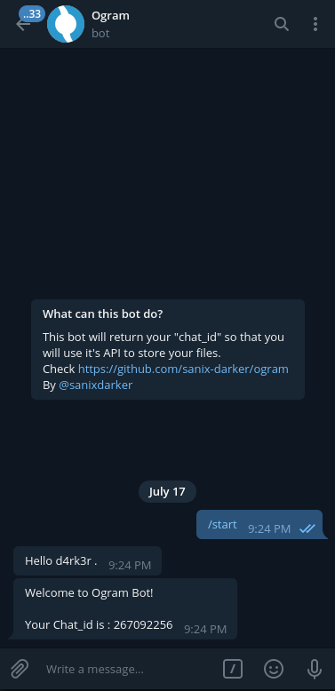

<p align="center">
  <h1>Ogram-Telegram-Bot</h1>
  A Tricky-Hack to use Telegram-servers as free "STORAGE" !
</p>

## Links

Ogram split a file >= 19MB, in multiples chunks and send it throught the Telegram-bot. All the links of the running project :
- [TEMPORY DEMO BOT-LINK (omega_gram_bot)](https://t.me/omega_gram_bot) <br>
- [TEMPORY DEMO API-LINK (ogram_api)](https://ogram_api.ngrok.io)
- [THE DOCUMENTATION-API](https://documenter.getpostman.com/view/2696027/SzYgRaw1?version=latest)

## Requirements

- Python (3.x recommended)
- Pip3
- You need to have an account on Telegram

## How to install

- Go to https://t.me/omega_gram_bot(Or create your own bot with Botfather)
- Start the bot by hitting the START button or just write `/start` and then ENTER, you will get in response, your chat_id, you will use it with requests to ogram API to send files..
- Mute notification of the bot (Optionnal but recommended, to notreceive notifications for each chunk you're sending)
- Go to your Telegram Settings > Advanced > Automatic media download and deactive it, that will prevent telegram to automatically download a chunk of a file you're uploading !
.
- Update your `example.cofig.txt` file to `config.txt` and provide a valid token if you're using you're personnal bot.
- Install dependencies:
```shell
pip3 install -r requirements.txt
```
## ScreenShots





## Author

- Sanix-darker
